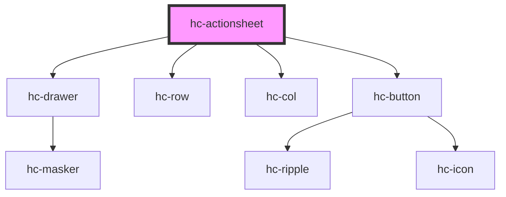

# hc-actionsheet

<!-- Auto Generated Below -->

## Properties

| Property | Attribute | Description | Type     | Default    |
| -------- | --------- | ----------- | -------- | ---------- |
| `mode`   | `mode`    |             | `string` | `'single'` |
| `titles` | `titles`  |             | `string` | `"请选择"`    |

## Methods

### `destory() => Promise<void>`

#### Returns

Type: `Promise<void>`

## Dependencies

### Depends on

- [hc-drawer](../hc-drawer)
- [hc-row](../hc-row)
- [hc-col](../hc-col)
- [hc-button](../hc-button)

### Graph

----------------------------------------------

*Built with [StencilJS](https://stenciljs.com/)*
