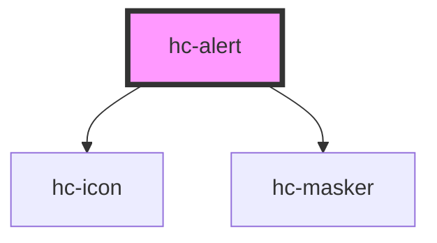

# hc-alert

<!-- Auto Generated Below -->

## Properties

| Property    | Attribute   | Description | Type      | Default     |
| ----------- | ----------- | ----------- | --------- | ----------- |
| `clickable` | `clickable` |             | `boolean` | `true`      |
| `display`   | `display`   |             | `boolean` | `undefined` |
| `masker`    | `masker`    |             | `boolean` | `true`      |

## Methods

### `destory() => Promise<void>`

#### Returns

Type: `Promise<void>`

### `generate(option?: object) => Promise<void>`

#### Returns

Type: `Promise<void>`

## Dependencies

### Depends on

- [hc-icon](../hc-icon)
- [hc-masker](../hc-masker)

### Graph

----------------------------------------------

*Built with [StencilJS](https://stenciljs.com/)*
