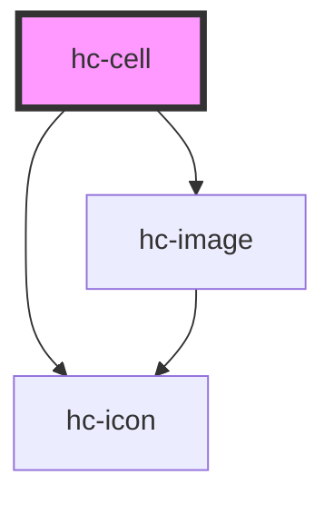

# hc-cell

<!-- Auto Generated Below -->

## Properties

| Property    | Attribute    | Description | Type     | Default     |
| ----------- | ------------ | ----------- | -------- | ----------- |
| `arrowIcon` | `arrow-icon` |             | `string` | `undefined` |
| `href`      | `href`       |             | `string` | `undefined` |
| `icon`      | `icon`       |             | `string` | `undefined` |
| `iconSize`  | `icon-size`  |             | `number` | `28`        |
| `label`     | `label`      |             | `string` | `undefined` |
| `value`     | `value`      |             | `string` | `undefined` |

## Dependencies

### Depends on

- [hc-image](../hc-image)
- [hc-icon](../hc-icon)

### Graph

----------------------------------------------

*Built with [StencilJS](https://stenciljs.com/)*
