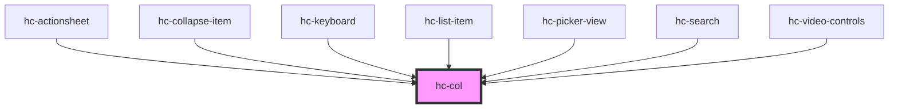

# hc-col

<!-- Auto Generated Below -->

## Properties

| Property | Attribute | Description | Type     | Default     |
| -------- | --------- | ----------- | -------- | ----------- |
| `align`  | `align`   |             | `string` | `undefined` |
| `flex`   | `flex`    |             | `number` | `undefined` |
| `span`   | `span`    |             | `number` | `undefined` |

## Dependencies

### Used by

 - [hc-actionsheet](../hc-actionsheet)
 - [hc-collapse-item](../hc-collapse-item)
 - [hc-keyboard](../hc-keyboard)
 - [hc-list-item](../hc-list-item)
 - [hc-picker-view](../hc-picker-view)
 - [hc-search](../hc-search)
 - [hc-video-controls](../hc-video-controls)

### Graph

----------------------------------------------

*Built with [StencilJS](https://stenciljs.com/)*
