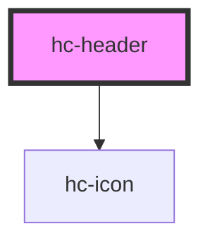

# hc-header

<!-- Auto Generated Below -->

## Properties

| Property | Attribute | Description | Type     | Default     |
| -------- | --------- | ----------- | -------- | ----------- |
| `label`  | `label`   |             | `string` | `undefined` |

## Dependencies

### Depends on

- [hc-icon](../hc-icon)

### Graph

----------------------------------------------

*Built with [StencilJS](https://stenciljs.com/)*
