# hc-icon

<!-- Auto Generated Below -->

## Properties

| Property | Attribute | Description | Type      | Default     |
| -------- | --------- | ----------- | --------- | ----------- |
| `color`  | `color`   |             | `string`  | `undefined` |
| `name`   | `name`    |             | `string`  | `undefined` |
| `size`   | `size`    |             | `number`  | `undefined` |
| `spin`   | `spin`    |             | `boolean` | `false`     |

## Events

| Event    | Description | Type               |
| -------- | ----------- | ------------------ |
| `vclick` |             | `CustomEvent<any>` |

## Dependencies

### Used by

 - [hc-actionsheet-item](../hc-actionsheet-item)
 - [hc-alert](../hc-alert)
 - [hc-button](../hc-button)
 - [hc-cell](../hc-cell)
 - [hc-checkbox](../hc-checkbox)
 - [hc-collapse-item](../hc-collapse-item)
 - [hc-header](../hc-header)
 - [hc-image](../hc-image)
 - [hc-input](../hc-input)
 - [hc-keyboard](../hc-keyboard)
 - [hc-list-item](../hc-list-item)
 - [hc-noticebar](../hc-noticebar)
 - [hc-notify](../hc-notify)
 - [hc-radio](../hc-radio)
 - [hc-rate-item](../hc-rate-item)
 - [hc-switch](../hc-switch)
 - [hc-tag](../hc-tag)
 - [hc-toast](../hc-toast)

### Graph

```mermaid
graph TD;
  hc-actionsheet-item --> hc-icon
  hc-alert --> hc-icon
  hc-button --> hc-icon
  hc-cell --> hc-icon
  hc-checkbox --> hc-icon
  hc-collapse-item --> hc-icon
  hc-header --> hc-icon
  hc-image --> hc-icon
  hc-input --> hc-icon
  hc-keyboard --> hc-icon
  hc-list-item --> hc-icon
  hc-noticebar --> hc-icon
  hc-notify --> hc-icon
  hc-radio --> hc-icon
  hc-rate-item --> hc-icon
  hc-switch --> hc-icon
  hc-tag --> hc-icon
  hc-toast --> hc-icon
  style hc-icon fill:#f9f,stroke:#333,stroke-width:4px
```

----------------------------------------------

*Built with [StencilJS](https://stenciljs.com/)*
