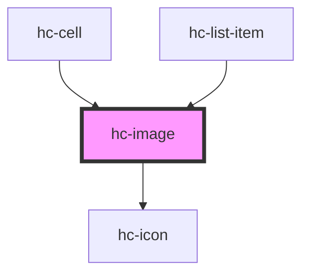

# hc-image

<!-- Auto Generated Below -->

## Properties

| Property    | Attribute   | Description | Type      | Default     |
| ----------- | ----------- | ----------- | --------- | ----------- |
| `fit`       | `fit`       |             | `string`  | `'cover'`   |
| `height`    | `height`    |             | `number`  | `undefined` |
| `lazy`      | `lazy`      |             | `boolean` | `undefined` |
| `radius`    | `radius`    |             | `number`  | `undefined` |
| `src`       | `src`       |             | `string`  | `undefined` |
| `status`    | `status`    |             | `number`  | `0`         |
| `watermark` | `watermark` |             | `string`  | `undefined` |
| `width`     | `width`     |             | `number`  | `undefined` |

## Dependencies

### Used by

 - [hc-cell](../hc-cell)
 - [hc-list-item](../hc-list-item)

### Depends on

- [hc-icon](../hc-icon)

### Graph

----------------------------------------------

*Built with [StencilJS](https://stenciljs.com/)*
