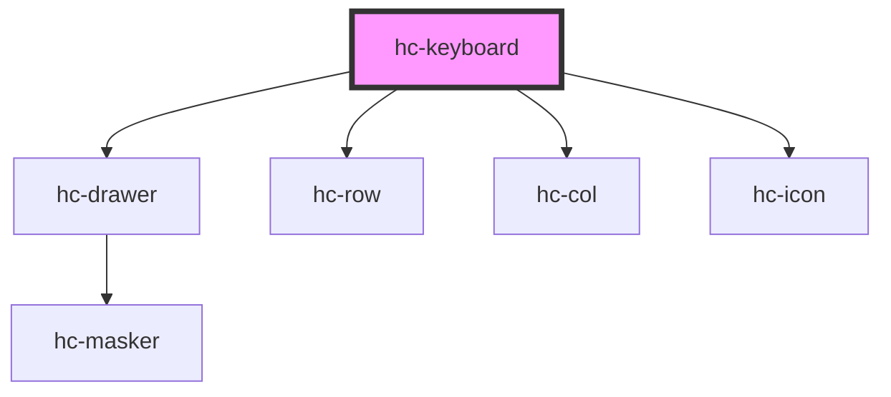

# hc-keyboard

<!-- Auto Generated Below -->

## Properties

| Property  | Attribute | Description | Type      | Default     |
| --------- | --------- | ----------- | --------- | ----------- |
| `change`  | `change`  |             | `boolean` | `false`     |
| `current` | `current` |             | `string`  | `undefined` |
| `type`    | `type`    |             | `string`  | `undefined` |
| `value`   | `value`   |             | `string`  | `''`        |
| `vibrate` | `vibrate` |             | `number`  | `100`       |

## Events

| Event     | Description | Type               |
| --------- | ----------- | ------------------ |
| `vchange` |             | `CustomEvent<any>` |

## Methods

### `destory() => Promise<void>`

#### Returns

Type: `Promise<void>`

## Dependencies

### Depends on

- [hc-drawer](../hc-drawer)
- [hc-row](../hc-row)
- [hc-col](../hc-col)
- [hc-icon](../hc-icon)

### Graph

----------------------------------------------

*Built with [StencilJS](https://stenciljs.com/)*
