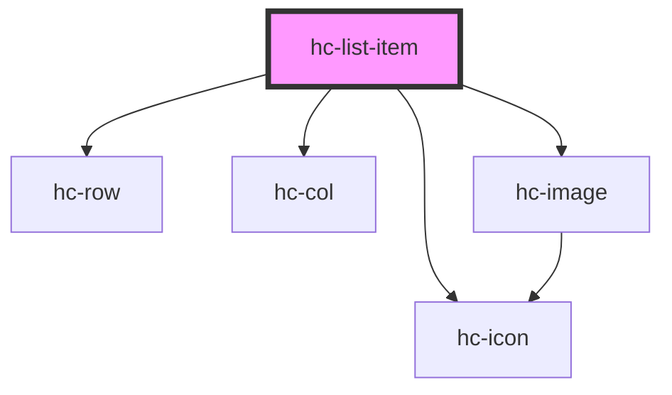

# hc-list-item

<!-- Auto Generated Below -->

## Properties

| Property      | Attribute      | Description | Type     | Default     |
| ------------- | -------------- | ----------- | -------- | ----------- |
| `appendColor` | `append-color` |             | `string` | `undefined` |
| `appendIcon`  | `append-icon`  |             | `string` | `undefined` |
| `cover`       | `cover`        |             | `string` | `undefined` |
| `coverHeight` | `cover-height` |             | `number` | `36`        |
| `coverWidth`  | `cover-width`  |             | `number` | `36`        |
| `date`        | `date`         |             | `string` | `undefined` |
| `heading`     | `heading`      |             | `string` | `undefined` |
| `size`        | `size`         |             | `string` | `undefined` |
| `type`        | `type`         |             | `string` | `'simple'`  |

## Dependencies

### Depends on

- [hc-row](../hc-row)
- [hc-col](../hc-col)
- [hc-icon](../hc-icon)
- [hc-image](../hc-image)

### Graph

----------------------------------------------

*Built with [StencilJS](https://stenciljs.com/)*
