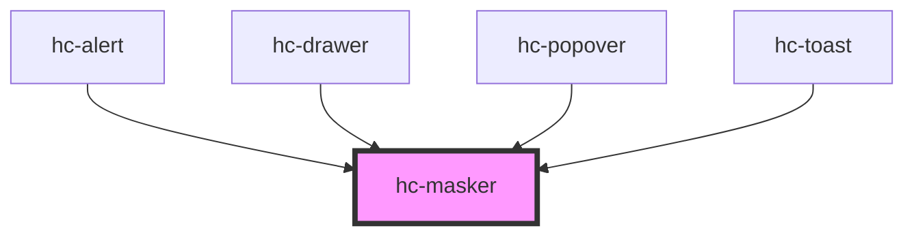

# hc-masker

<!-- Auto Generated Below -->

## Properties

| Property    | Attribute   | Description | Type      | Default             |
| ----------- | ----------- | ----------- | --------- | ------------------- |
| `clickable` | `clickable` |             | `boolean` | `true`              |
| `command`   | `command`   |             | `boolean` | `false`             |
| `display`   | `display`   |             | `boolean` | `false`             |
| `fill`      | `fill`      |             | `string`  | `'rgba(0,0,0,0.7)'` |
| `offset`    | `offset`    |             | `number`  | `undefined`         |
| `place`     | `place`     |             | `string`  | `undefined`         |

## Events

| Event    | Description | Type               |
| -------- | ----------- | ------------------ |
| `vclick` |             | `CustomEvent<any>` |

## Methods

### `destory() => Promise<void>`

#### Returns

Type: `Promise<void>`

### `generate(option?: object) => Promise<void>`

#### Returns

Type: `Promise<void>`

## Dependencies

### Used by

 - [hc-alert](../hc-alert)
 - [hc-drawer](../hc-drawer)
 - [hc-popover](../hc-popover)
 - [hc-toast](../hc-toast)

### Graph

----------------------------------------------

*Built with [StencilJS](https://stenciljs.com/)*
