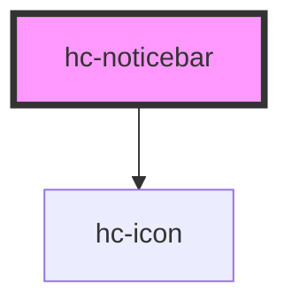

# hc-noticebar

<!-- Auto Generated Below -->

## Properties

| Property     | Attribute    | Description | Type      | Default     |
| ------------ | ------------ | ----------- | --------- | ----------- |
| `closable`   | `closable`   |             | `boolean` | `undefined` |
| `color`      | `color`      |             | `string`  | `undefined` |
| `icon`       | `icon`       |             | `string`  | `undefined` |
| `scrollable` | `scrollable` |             | `boolean` | `true`      |
| `speed`      | `speed`      |             | `number`  | `80`        |

## Events

| Event   | Description | Type               |
| ------- | ----------- | ------------------ |
| `vhide` |             | `CustomEvent<any>` |

## Methods

### `destory() => Promise<void>`

#### Returns

Type: `Promise<void>`

## Dependencies

### Depends on

- [hc-icon](../hc-icon)

### Graph

----------------------------------------------

*Built with [StencilJS](https://stenciljs.com/)*
