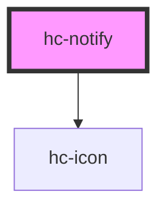

# hc-notify

<!-- Auto Generated Below -->

## Properties

| Property   | Attribute  | Description | Type      | Default     |
| ---------- | ---------- | ----------- | --------- | ----------- |
| `align`    | `align`    |             | `string`  | `'left'`    |
| `closable` | `closable` |             | `boolean` | `undefined` |
| `duration` | `duration` |             | `number`  | `3000`      |
| `icon`     | `icon`     |             | `string`  | `undefined` |
| `place`    | `place`    |             | `string`  | `'up'`      |
| `visible`  | `visible`  |             | `boolean` | `undefined` |

## Methods

### `destory() => Promise<void>`

#### Returns

Type: `Promise<void>`

### `generate(option?: Object) => Promise<void>`

#### Returns

Type: `Promise<void>`

### `show() => Promise<void>`

#### Returns

Type: `Promise<void>`

## Dependencies

### Depends on

- [hc-icon](../hc-icon)

### Graph

----------------------------------------------

*Built with [StencilJS](https://stenciljs.com/)*
