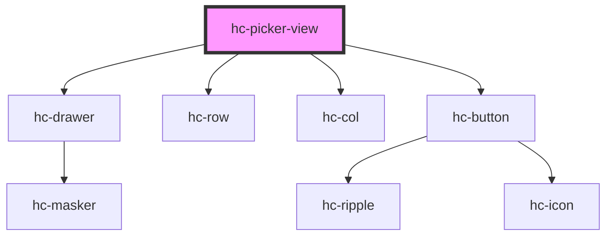

# hc-picker-view

<!-- Auto Generated Below -->

## Properties

| Property | Attribute | Description | Type     | Default |
| -------- | --------- | ----------- | -------- | ------- |
| `titles` | `titles`  |             | `string` | `'请选择'` |

## Methods

### `destory() => Promise<void>`

#### Returns

Type: `Promise<void>`

### `parse(source: any, value: any) => Promise<{ source: any; data: any[]; value: any[]; valueString: any; }>`

#### Returns

Type: `Promise<{ source: any; data: any[]; value: any[]; valueString: any; }>`

## Dependencies

### Depends on

- [hc-drawer](../hc-drawer)
- [hc-row](../hc-row)
- [hc-col](../hc-col)
- [hc-button](../hc-button)

### Graph

----------------------------------------------

*Built with [StencilJS](https://stenciljs.com/)*
