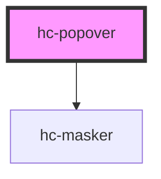

# hc-popover

<!-- Auto Generated Below -->

## Properties

| Property  | Attribute | Description | Type      | Default     |
| --------- | --------- | ----------- | --------- | ----------- |
| `masker`  | `masker`  |             | `boolean` | `undefined` |
| `offset`  | `offset`  |             | `number`  | `10`        |
| `place`   | `place`   |             | `string`  | `''`        |
| `visible` | `visible` |             | `boolean` | `undefined` |

## Dependencies

### Depends on

- [hc-masker](../hc-masker)

### Graph

----------------------------------------------

*Built with [StencilJS](https://stenciljs.com/)*
