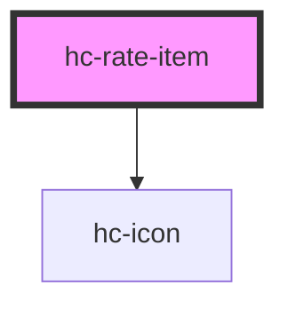

# hc-rate-item

<!-- Auto Generated Below -->

## Properties

| Property      | Attribute      | Description | Type      | Default             |
| ------------- | -------------- | ----------- | --------- | ------------------- |
| `active`      | `active`       |             | `boolean` | `undefined`         |
| `activeColor` | `active-color` |             | `string`  | `undefined`         |
| `activeIcon`  | `active-icon`  |             | `string`  | `'collection-fill'` |
| `half`        | `half`         |             | `boolean` | `undefined`         |
| `label`       | `label`        |             | `string`  | `undefined`         |
| `size`        | `size`         |             | `number`  | `28`                |
| `voidColor`   | `void-color`   |             | `string`  | `undefined`         |
| `voidIcon`    | `void-icon`    |             | `string`  | `'collection'`      |

## Dependencies

### Depends on

- [hc-icon](../hc-icon)

### Graph

----------------------------------------------

*Built with [StencilJS](https://stenciljs.com/)*
