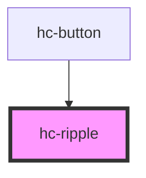

# hc-ripple

<!-- Auto Generated Below -->

## Properties

| Property | Attribute | Description | Type      | Default     |
| -------- | --------- | ----------- | --------- | ----------- |
| `color`  | `color`   |             | `string`  | `undefined` |
| `mask`   | `mask`    |             | `boolean` | `undefined` |
| `size`   | `size`    |             | `number`  | `undefined` |

## Dependencies

### Used by

 - [hc-button](../hc-button)

### Graph

----------------------------------------------

*Built with [StencilJS](https://stenciljs.com/)*
