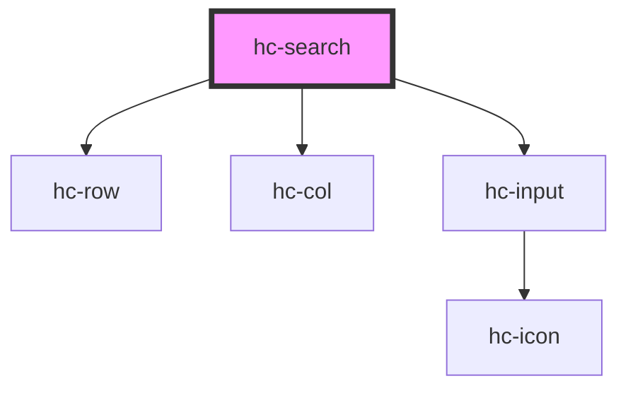

# hc-search

<!-- Auto Generated Below -->

## Properties

| Property      | Attribute     | Description | Type      | Default     |
| ------------- | ------------- | ----------- | --------- | ----------- |
| `clearable`   | `clearable`   |             | `boolean` | `undefined` |
| `icon`        | `icon`        |             | `string`  | `'search'`  |
| `iconSize`    | `icon-size`   |             | `number`  | `24`        |
| `placeholder` | `placeholder` |             | `string`  | `undefined` |
| `shape`       | `shape`       |             | `string`  | `'conner'`  |

## Dependencies

### Depends on

- [hc-row](../hc-row)
- [hc-col](../hc-col)
- [hc-input](../hc-input)

### Graph

----------------------------------------------

*Built with [StencilJS](https://stenciljs.com/)*
