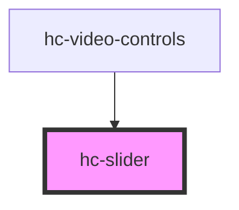

# hc-slider

<!-- Auto Generated Below -->

## Properties

| Property   | Attribute  | Description | Type      | Default     |
| ---------- | ---------- | ----------- | --------- | ----------- |
| `color`    | `color`    |             | `string`  | `undefined` |
| `disabled` | `disabled` |             | `boolean` | `false`     |
| `max`      | `max`      |             | `number`  | `100`       |
| `min`      | `min`      |             | `number`  | `0`         |
| `readonly` | `readonly` |             | `boolean` | `false`     |
| `size`     | `size`     |             | `string`  | `undefined` |
| `step`     | `step`     |             | `number`  | `undefined` |
| `value`    | `value`    |             | `number`  | `0`         |

## Events

| Event     | Description | Type               |
| --------- | ----------- | ------------------ |
| `vchange` |             | `CustomEvent<any>` |

## Dependencies

### Used by

 - [hc-video-controls](../hc-video-controls)

### Graph

----------------------------------------------

*Built with [StencilJS](https://stenciljs.com/)*
