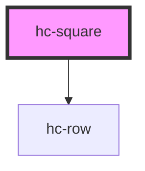

# hc-square

<!-- Auto Generated Below -->

## Properties

| Property   | Attribute  | Description | Type      | Default     |
| ---------- | ---------- | ----------- | --------- | ----------- |
| `autoplay` | `autoplay` |             | `boolean` | `undefined` |
| `column`   | `column`   |             | `number`  | `3`         |
| `row`      | `row`      |             | `number`  | `undefined` |

## Dependencies

### Depends on

- [hc-row](../hc-row)

### Graph

----------------------------------------------

*Built with [StencilJS](https://stenciljs.com/)*
