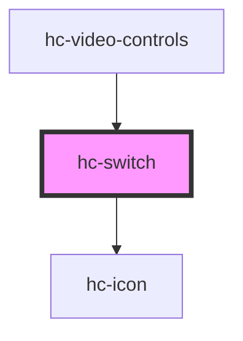

# hc-switch

<!-- Auto Generated Below -->

## Properties

| Property     | Attribute     | Description | Type      | Default     |
| ------------ | ------------- | ----------- | --------- | ----------- |
| `activeIcon` | `active-icon` |             | `string`  | `undefined` |
| `checked`    | `checked`     |             | `boolean` | `undefined` |
| `iconSize`   | `icon-size`   |             | `number`  | `36`        |
| `offIcon`    | `off-icon`    |             | `string`  | `undefined` |
| `type`       | `type`        |             | `string`  | `'default'` |

## Events

| Event     | Description | Type               |
| --------- | ----------- | ------------------ |
| `vchange` |             | `CustomEvent<any>` |

## Dependencies

### Used by

 - [hc-video-controls](../hc-video-controls)

### Depends on

- [hc-icon](../hc-icon)

### Graph

----------------------------------------------

*Built with [StencilJS](https://stenciljs.com/)*
