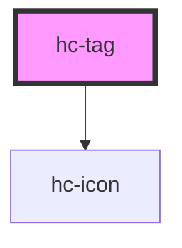

# hc-tag

<!-- Auto Generated Below -->

## Properties

| Property     | Attribute    | Description | Type      | Default     |
| ------------ | ------------ | ----------- | --------- | ----------- |
| `background` | `background` |             | `string`  | `undefined` |
| `closable`   | `closable`   |             | `boolean` | `false`     |
| `color`      | `color`      |             | `string`  | `undefined` |
| `plain`      | `plain`      |             | `boolean` | `undefined` |

## Events

| Event    | Description | Type               |
| -------- | ----------- | ------------------ |
| `vclose` |             | `CustomEvent<any>` |

## Dependencies

### Depends on

- [hc-icon](../hc-icon)

### Graph

----------------------------------------------

*Built with [StencilJS](https://stenciljs.com/)*
