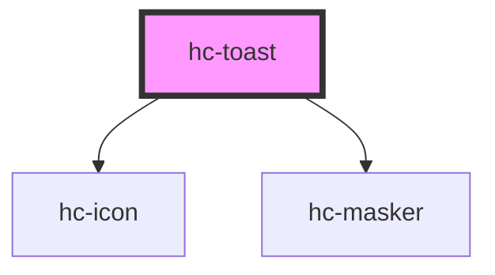

# hc-toast

<!-- Auto Generated Below -->

## Properties

| Property   | Attribute   | Description | Type      | Default     |
| ---------- | ----------- | ----------- | --------- | ----------- |
| `display`  | `display`   |             | `boolean` | `false`     |
| `duration` | `duration`  |             | `number`  | `3000`      |
| `fill`     | `fill`      |             | `string`  | `undefined` |
| `icon`     | `icon`      |             | `string`  | `undefined` |
| `iconSize` | `icon-size` |             | `number`  | `48`        |
| `place`    | `place`     |             | `string`  | `'center'`  |
| `theme`    | `theme`     |             | `string`  | `'dark'`    |

## Methods

### `generate(option?: object) => Promise<void>`

#### Returns

Type: `Promise<void>`

## Dependencies

### Depends on

- [hc-icon](../hc-icon)
- [hc-masker](../hc-masker)

### Graph

----------------------------------------------

*Built with [StencilJS](https://stenciljs.com/)*
