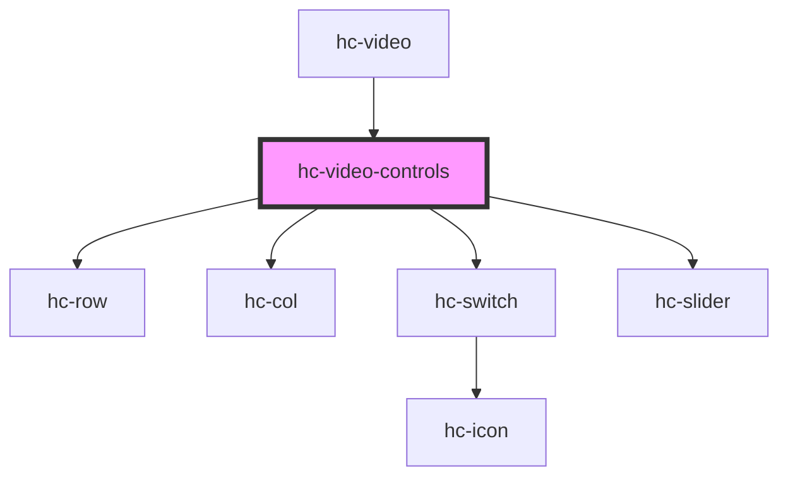

# hc-video-controls

<!-- Auto Generated Below -->

## Properties

| Property   | Attribute  | Description | Type      | Default     |
| ---------- | ---------- | ----------- | --------- | ----------- |
| `current`  | `current`  |             | `number`  | `0`         |
| `duration` | `duration` |             | `number`  | `undefined` |
| `muted`    | `muted`    |             | `boolean` | `undefined` |
| `play`     | `play`     |             | `boolean` | `undefined` |

## Events

| Event       | Description | Type               |
| ----------- | ----------- | ------------------ |
| `vmute`     |             | `CustomEvent<any>` |
| `vplay`     |             | `CustomEvent<any>` |
| `vprogress` |             | `CustomEvent<any>` |

## Dependencies

### Used by

 - [hc-video](../hc-video)

### Depends on

- [hc-row](../hc-row)
- [hc-col](../hc-col)
- [hc-switch](../hc-switch)
- [hc-slider](../hc-slider)

### Graph

----------------------------------------------

*Built with [StencilJS](https://stenciljs.com/)*
