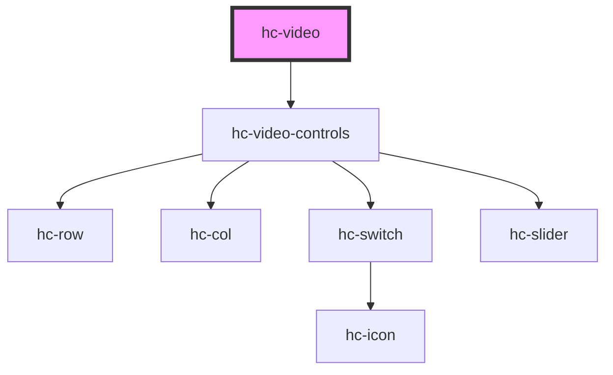

# hc-video

<!-- Auto Generated Below -->

## Properties

| Property   | Attribute  | Description | Type      | Default      |
| ---------- | ---------- | ----------- | --------- | ------------ |
| `autoplay` | `autoplay` |             | `boolean` | `false`      |
| `controls` | `controls` |             | `boolean` | `false`      |
| `current`  | `current`  |             | `number`  | `0`          |
| `duration` | `duration` |             | `number`  | `0`          |
| `height`   | `height`   |             | `number`  | `undefined`  |
| `loaded`   | `loaded`   |             | `number`  | `0`          |
| `muted`    | `muted`    |             | `boolean` | `undefined`  |
| `network`  | `network`  |             | `number`  | `undefined`  |
| `play`     | `play`     |             | `boolean` | `false`      |
| `poster`   | `poster`   |             | `string`  | `undefined`  |
| `preload`  | `preload`  |             | `string`  | `'metadata'` |
| `src`      | `src`      |             | `string`  | `undefined`  |

## Dependencies

### Depends on

- [hc-video-controls](../hc-video-controls)

### Graph

----------------------------------------------

*Built with [StencilJS](https://stenciljs.com/)*
